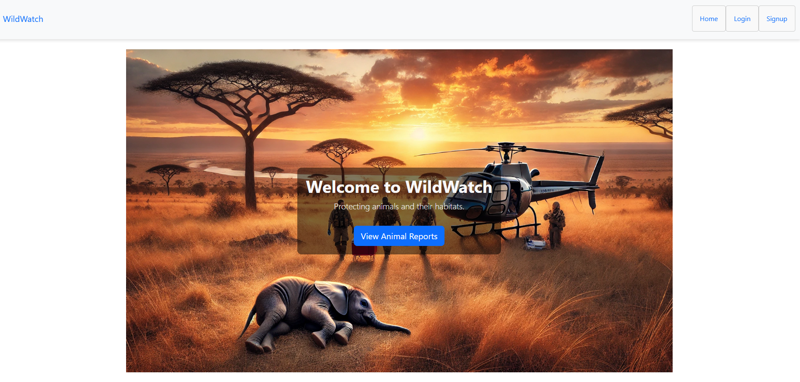
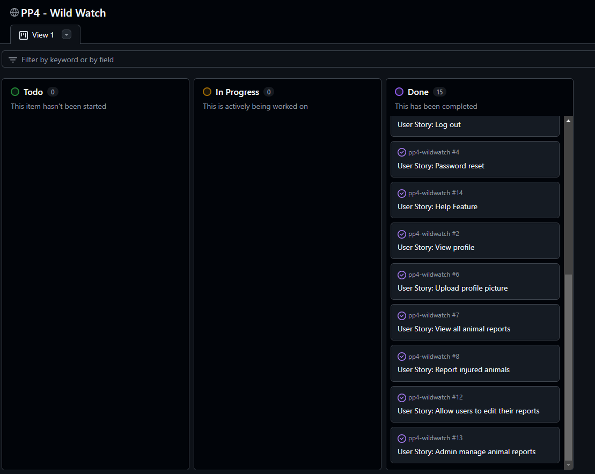
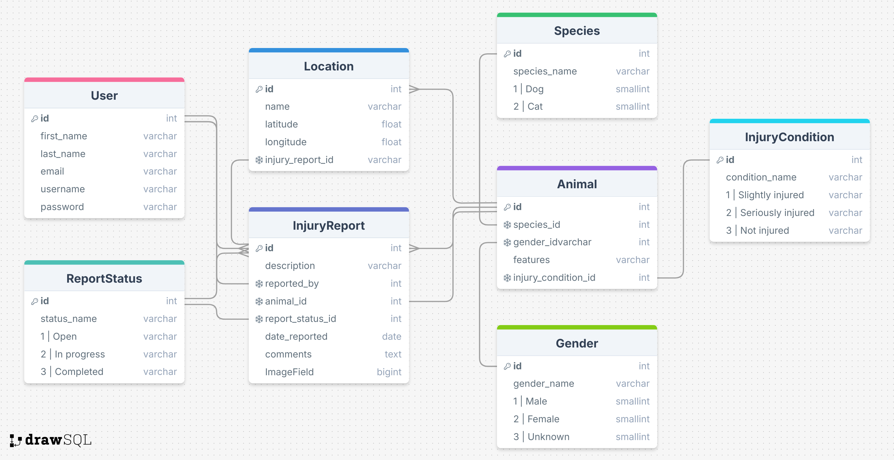
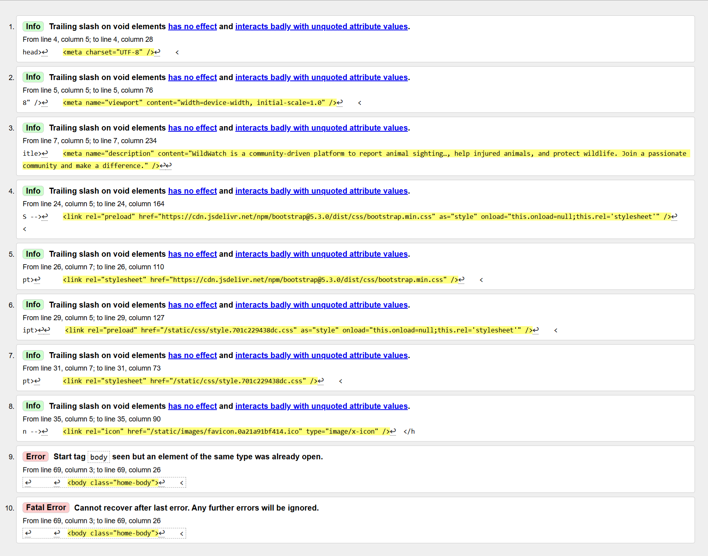
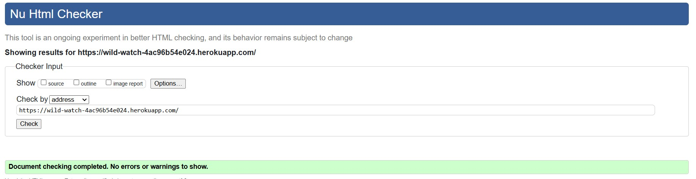
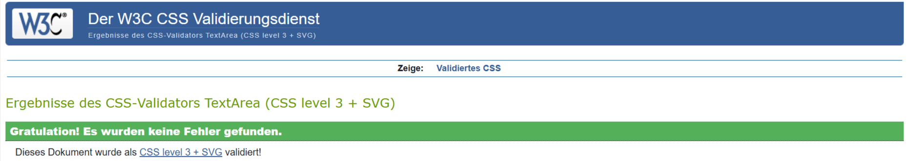
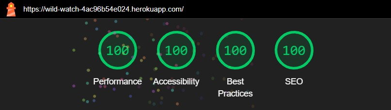

# Wild Watch

[Live webpage:](https://wild-watch-4ac96b54e024.herokuapp.com/)

## Developer

| Name            | Linkedin                     | GitHub           |
| --------------- | ---------------------------- | ---------------- |
| Christian Borza | [Linkedin Profile](https://www.linkedin.com/in/borzachristian/) | [GitHub repositories](https://github.com/ChrisCross1983) |

## About

Wild Watch is a full-stack Django web application designed to assist users in reporting wildlife sightings to promote conservation efforts. The platform enables users to create, view, and manage reports while fostering community engagement around wildlife protection. The project is inspired by a shared goal to support environmental awareness and provide users with an easy way to contribute to nature conservation.

## Project Goals

### User Goals

- Provide an intuitive way to report wildlife sightings.
- Allow users to manage their reports (create, update, delete).
- Offer a way to stay updated on submitted reports by other users.

### Business Owner Goals

- Establish a user-friendly platform for wildlife data collection.
- Build a community engaged in wildlife conservation.
- Ensure secure and seamless functionality for report management.

## User Experience

### Target Audience

- Animal & Wildlife enthusiasts.
- Environmental activists and organizations.
- General users interested in contributing to wildlife protection efforts.

### User Requirements and Expectations

- Accessible and responsive design.
- Simple navigation and intuitive layout.
- Clear feedback during interactions (e.g., successful submission or errors).
- Secure user authentication.

### User Stories

#### Users

As a user I want to:

1. Register and verify my account to start using the platform.
2. Log in and out securely.
3. Create and submit wildlife sighting reports.
4. Edit or delete my reports.
5. View all wildlife reports submitted by others.

#### Site Owner

As a site owner I want to:

1. Monitor user-submitted reports for quality and accuracy.
2. Manage user accounts efficiently.

### Agile Methodologies

The project followed Agile principles using:

- GitHub Projects: Kanban board to track tasks and progress.
- User Stories: Each feature aligned with specific user or business needs.

[Link to GitHub Project Board](https://github.com/users/ChrisCross1983/projects/5)

## Design

### Colors

Primary: Green (#1A7F3C) – Symbolizing nature and conservation.
Secondary: Neutral tones (#F4F4F4, #333333) for readability and aesthetics.

(Image of Color Scheme)

### Fonts

- Headings: Montserrat (Google Fonts).
- Body: Roboto (Google Fonts).

### Structure

The website has a clean and minimalistic structure, ensuring ease of navigation. It includes:

- A header with a navigation bar.
- A main content area for dynamic views.
- A footer with links to external resources and site information.

### Wireframes

Wireframes were designed for desktop, tablet, and mobile views using Balsamiq. 

[Wireframe images or links]

## Database Diagram

The application uses a relational database with key models:

User: Stores user authentication details.
Profile: Extends user with additional fields (e.g., email verification token).
Report: Captures wildlife sighting details.

## Messages and Interaction With Users

Users receive feedback via:

- Success messages for actions like account verification and report submission.
- Error messages for invalid actions, e.g., logging in with unverified accounts.
- Alerts styled using Bootstrap for clarity.

## Admin Panel/Superuser

The admin panel provides complete CRUD functionality for managing users and reports.

Accessible only to authorized administrators.

## Technologies Used

### Languages

- Python
- HTML5
- CSS3
- JavaScript

### Libraries & Frameworks

- Django
- Bootstrap

### Django Packages

- Django Allauth: User authentication and management.
- Django Messages: Flash messages for user feedback.

## Features

### Implemented Features

User Authentication: Secure registration, login, and logout.
Report Management: Create, read, update, and delete wildlife reports.
Dynamic Feedback: Inform users about actions via messages.

### Planned Features

- Social sharing of reports.
- Enhanced data visualization for wildlife statistics.

## Validation

HTML, CSS, and Python code were validated using standard tools to ensure compliance and best practices.

(Screenshot Test Results)

## Accessibility

- The platform adheres to WCAG 2.1 guidelines.
- ARIA roles and labels are implemented for better screen reader compatibility.

## Performance

The website is optimized for speed and scalability, ensuring smooth functionality across devices.

(Screenshot)

## Device Testing

The application was tested on:

- Desktop: Windows and macOS.
- Mobile: Android and iOS devices.

## Browser Compatibility

Tested and verified on:

- Google Chrome
- Mozilla Firefox
- Microsoft Edge

## Testing

### Automated Testing

- **HTML Validation**: Used the [W3C HTML Validator](https://validator.w3.org/) which returned the following results:

    **Before**:
    

    **After**:
    

- **CSS Validation**: Used the [W3C CSS Validator](https://jigsaw.w3.org/css-validator/) which returned the following results:

    

- **JavaScript Validation**: Used [JSHint](https://jshint.com/) to validate JavaScript code. The validation process returned a clean report compliant with ES6+ standards.

### Lighthouse scores

Lighthouse metrics were scored on Incognito Chrome

### Manual Testing

Features were manually tested by creating various user scenarios to ensure functionality.

## Bugs

### Known Issues

- Minor responsiveness issues on older devices.

### Resolved Issues

- Fixed email verification token bugs.

## Deployment

The application was deployed using Heroku with the following steps:

1. Push code to GitHub repository.
2. Connect the repository to Heroku.
3. Configure environment variables and deploy.

## Credits

webaim.org - Contrast checker
tinypng.com - Convert images
icons8.de - Favicon

### Media

- Placeholder images from Unsplash.

## Further Developments

- Add real-time notifications for new reports.
- Implement user badges for contributions.

## Acknowledgements

I would like to thank those who were a great support and inspiration during writing this project:

- My wife, who supported me during the process of creating this project.
