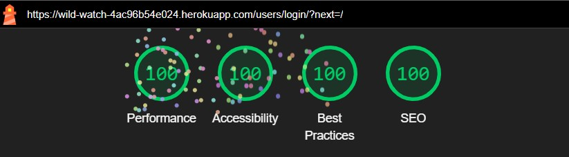
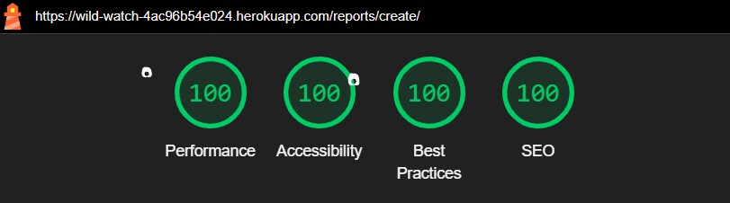
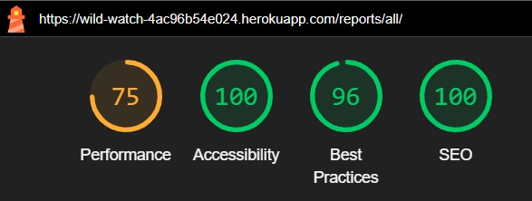
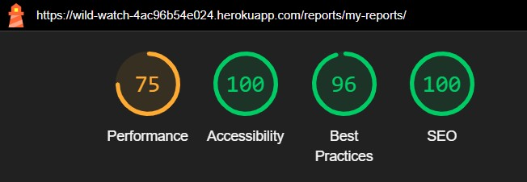
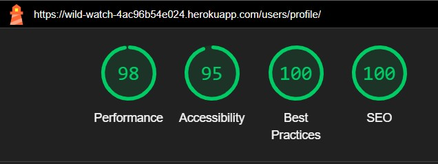
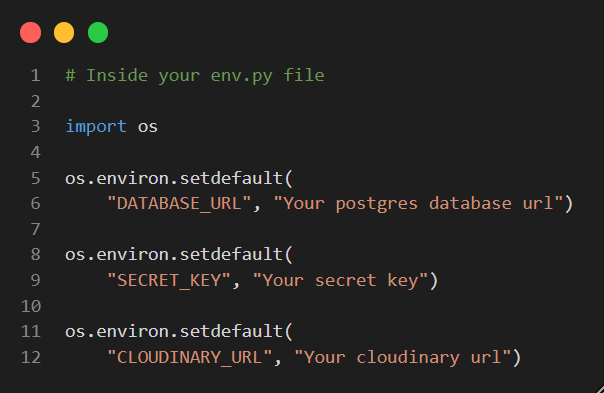
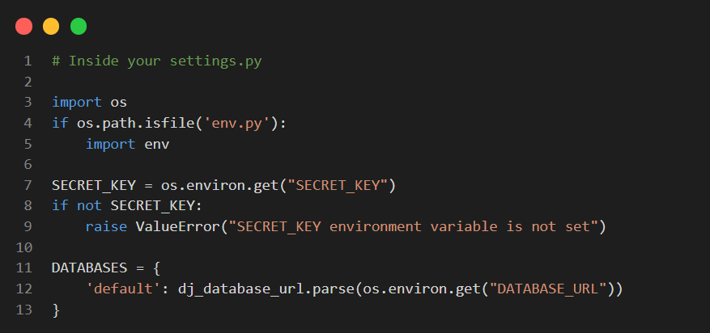

# Wild Watch

[Live webpage:](https://wild-watch-4ac96b54e024.herokuapp.com/)

## Developer

| Name            | Linkedin                     | GitHub           |
| --------------- | ---------------------------- | ---------------- |
| Christian Borza | [Linkedin Profile](https://www.linkedin.com/in/borzachristian/) | [GitHub repositories](https://github.com/ChrisCross1983) |

## About

Wild Watch is a full-stack Django web application designed to assist users in reporting wildlife sightings to promote conservation efforts. The platform enables users to create, view, and manage reports while fostering community engagement around wildlife protection. The project is inspired by a shared goal to support environmental awareness and provide users with an easy way to contribute to nature conservation.

## Project Goals

### User Goals

- Provide an intuitive way to report wildlife sightings.
- Allow users to manage their reports (create, update, delete).
- Offer a way to stay updated on submitted reports by other users.

### Business Owner Goals

- Establish a user-friendly platform for wildlife data collection.
- Build a community engaged in wildlife conservation.
- Ensure secure and seamless functionality for report management.

## User Stories

### 1. User Registration  
**As a new user**, I want an easy account setup to enjoy personalized features.  
**Acceptance:** Users enter email, username, and password. Errors show for taken usernames/emails.

### 2. Email Verification  
**As a user**, I want to verify my email to activate my account securely.  
**Acceptance:** System sends confirmation email. Unverified users get reminder and can resend link.

### 3. Login  
**As a user**, I want to log in securely with my credentials.  
**Acceptance:** Valid username and password allow access. Errors are shown for invalid attempts.

### 4. Logout  
**As a user**, I want to log out to end my session securely.  
**Acceptance:** Clicking logout redirects to homepage and ends session.

### 5. Password Reset  
**As a user**, I want to reset my password in case I forget it.  
**Acceptance:** Users request reset link via email and create new password.

### 6. View Profile  
**As a user**, I want to view my personal profile and account data.  
**Acceptance:** Profile page displays name, username, email, and profile picture.

### 7. Edit Profile  
**As a user**, I want to update my account information.  
**Acceptance:** Users can change name, email, picture. Confirmation messages shown after saving.

### 8. Change Email Address  
**As a user**, I want to change my email address and verify it again.  
**Acceptance:** After email change, user is logged out and must re-verify new address.

### 9. Upload Profile Picture  
**As a user**, I want to upload a personal profile image.  
**Acceptance:** Uploaded picture is displayed in the profile view. Fallback image used if none uploaded.

### 10. Delete Account  
**As a user**, I want the option to delete my account permanently.  
**Acceptance:** A confirmation prompt ensures users really want to delete. Account is removed from database.

### 11. Create Report  
**As a user**, I want to report injured or sighted animals.  
**Acceptance:** Users complete form with required fields. Upon success, report is stored.

### 12. Edit Report  
**As a user**, I want to correct or update information in my report.  
**Acceptance:** Users can edit their own reports. Changes are saved and displayed after approval.

### 13. Delete Report  
**As a user**, I want to remove reports I created.  
**Acceptance:** Users confirm deletion before report is removed.

### 14. View All Reports  
**As a user**, I want to browse existing wildlife reports.  
**Acceptance:** Reports are shown in a list view with filters and pagination.

### 15. Filter Reports  
**As a user**, I want to filter reports by species or keywords.  
**Acceptance:** Filtered results are shown immediately based on user input.

### 16. Help on Report  
**As a user**, I want to volunteer to help on a report.  
**Acceptance:** Button adds user as helper. System prevents duplicate actions during load time.

### 17. Cancel Help  
**As a user**, I want to withdraw my help from a report.  
**Acceptance:** Users confirm cancellation, system removes them from helper list.

### 18. View Report Details  
**As a user**, I want to see full details of each report.  
**Acceptance:** Clicking “View Details” shows expanded view with all report data and helper status.

## User Experience

### Target Audience

- Animal & Wildlife enthusiasts.
- Environmental activists and organizations.
- General users interested in contributing to wildlife protection efforts.

### User Requirements and Expectations

- Accessible and responsive design.
- Simple navigation and intuitive layout.
- Clear feedback during interactions (e.g., successful submission or errors).
- Secure user authentication.

### Agile Methodologies

The project followed Agile principles using:

- GitHub Projects: Kanban board to track tasks and progress.
- User Stories: Each feature aligned with specific user or business needs.

[Link to GitHub Project Board](https://github.com/users/ChrisCross1983/projects/5)

## Design

### Design Decisions

The overall design of Wild Watch was created with clarity, accessibility, and emotional connection in mind. The color palette reflects a nature-oriented theme to align with the purpose of wildlife protection.

### Colors

Primary colors include:

- **Yellow-Orange (#FFC857)**: The main branding color used for the navigation bar and general call-to-action elements, evoking warmth and attention.
- **Green (#1A7F3C)**: A secondary accent color representing nature, conservation, and helper status indicators.
- **Neutral tones (#F4F4F4, #333333)**: Provide balance and contrast for a readable, clean user interface.

### Color Scheme

The visual identity of Wild Watch is based on warm, natural tones that reflect wildlife and conservation.

| Hex Code  | Usage                | Description                                                      |
|-----------|----------------------|------------------------------------------------------------------|
| `#FFC857` | Primary / Navbar     | Main brand color for navigation and call-to-actions              |
| `#1A7F3C` | Success / Text Icons | Green tone used in helper labels and visual accents              |
| `#F4E4BC` | Section Background   | Soft beige background for content blocks                         |
| `#D67B4B` | CTA-Highlight        | Contrast color for emphasis in special sections                  |
| `#42C460` | Success Badge        | Used to indicate successful report interaction                   |
| `#F0B914` | Warning Badge        | Warning and pending status visuals                               |
| `#830814` | Danger Badge         | Error messages and rejected reports                              |
| `#49A9E9` | Info Badge           | Informational elements and icons                                 |
| `#333333` | Main Text Color      | Strong dark tone for body and headline text                      |
| `#F4F4F4` | Light BG Elements    | Light grey for containers and subtle background elements         |

> *Note:* Additional utility classes from Bootstrap (e.g., `.btn-success`, `.alert-danger`) were partially customized to reflect this color palette.

### Fonts

Typography was selected for readability and aesthetic harmony:

- **Headings:** Montserrat (modern, clean).
- **Body text:** Open Sans and Arial (easy to read across devices).

### Layout & Structure

The layout follows a structured, user-friendly approach:

- **Card-based design** for displaying reports in a clear and organized format.
- **Fixed navigation bar** to ensure consistent access to main features.
- **Sidebar filters** for intuitive content sorting.
- **Hero sections** with immersive background images to highlight the context of each page (e.g., rhino, elephant, leopard visuals).
- **Mobile-first responsiveness** ensures accessibility on all screen sizes.

Visual hierarchy was created through:

- **Consistent button styles** (primary, danger, success, etc.) to guide user actions.
- **Badges and alert styles** to highlight report status and feedback.
- **Rounded elements** (cards, buttons, images) for a soft and friendly visual appeal.

### Wireframes

Wireframes were designed for desktop, tablet, and mobile views using Balsamiq. 

[Wireframe images or links]

## Database Diagram

The application uses a relational database with key models:

User: Stores user authentication details.
Profile: Extends user with additional fields (e.g., email verification token).
Report: Captures wildlife sighting details.

## Messages and Interaction With Users

Users receive feedback via:

- Success messages for actions like account verification and report submission.
- Error messages for invalid actions, e.g., logging in with unverified accounts.
- Alerts styled using Bootstrap for clarity.

## Admin Panel/Superuser

The admin panel provides complete CRUD functionality for managing users and reports.

Accessible only to authorized administrators.

## Technologies Used

### Languages

- Python
- HTML5
- CSS3
- JavaScript

### Libraries & Frameworks

- Django
- Bootstrap

### Django Packages

- Django Allauth: User authentication and management.
- Django Messages: Flash messages for user feedback.

## Features

### Implemented Features

User Authentication: Secure registration, login, and logout.
Report Management: Create, read, update, and delete wildlife reports.
Dynamic Feedback: Inform users about actions via messages.

### Planned Features

- Social sharing of reports.
- Enhanced data visualization for wildlife statistics.

## Accessibility

- The platform adheres to WCAG 2.1 guidelines.
- ARIA roles and labels are implemented for better screen reader compatibility.

## Performance

The website is optimized for speed and scalability, ensuring smooth functionality across devices.

(Screenshot)

## Device Testing

The application was tested on:

- Desktop: Windows and macOS.
- Mobile: Android and iOS devices.

## Browser Compatibility

Tested and verified on:

- Google Chrome
- Mozilla Firefox
- Microsoft Edge

## Testing

### Automated Testing

- **HTML Validation**: Used the [W3C HTML Validator](https://validator.w3.org/) which returned the following results:

    **Before**:
    

    **After**:
    

- **CSS Validation**: Used the [W3C CSS Validator](https://jigsaw.w3.org/css-validator/) which returned the following results:

    

- **JavaScript Validation**: Used [JSHint](https://jshint.com/) to validate JavaScript code. The validation process returned a clean report compliant with ES6+ standards.

### Lighthouse scores

Lighthouse metrics were scored on Incognito Chrome

### Running Tests

Although automated tests (e.g., unit tests or integration tests) are considered best practice in professional development workflows, they were not implemented in this project. The project scope focused primarily on core functionality, UI/UX design, and manual end-to-end testing in line with the PP4 requirements.

### Manual Testing

All core user workflows were tested manually and documented in detail to ensure full functional coverage and usability.

| Test Name                          | Steps                                                                                                  | Expected Result                                                       | Actual Result              | Pass/Fail |
|-----------------------------------|--------------------------------------------------------------------------------------------------------|------------------------------------------------------------------------|----------------------------|-----------|
| Home Navigation                   | 1. Click on "WildWatch" logo or Home link in navbar.                                                  | User is redirected to homepage.                                      | Same as expected           | ✓         |
| Signup Process                    | 1. Click Signup > Fill form > Submit.                                                                  | Account created & verification email sent.                           | Same as expected           | ✓         |
| Signup with invalid data          | 1. Leave required fields empty > Submit form.                                                          | Error messages are shown.                                             | Same as expected           | ✓         |
| Email Confirmation Flow           | 1. Register user > Click confirmation link in email.                                                   | Account gets activated.                                              | Same as expected           | ✓         |
| Resend Verification Email         | 1. Try to login without verification > Click “Resend Email”.                                           | New confirmation email is sent.                                      | Same as expected           | ✓         |
| Login with valid credentials      | 1. Enter correct credentials > Submit.                                                                 | User logs in successfully.                                           | Same as expected           | ✓         |
| Login with inactive user          | 1. Try login with unverified account.                                                                 | Warning message is shown: “Account not verified”.                    | Same as expected           | ✓         |
| Login with wrong password         | 1. Enter incorrect password.                                                                           | Error message: "Invalid password."                                   | Same as expected           | ✓         |
| Password Reset Flow               | 1. Click “Forgot password” > Enter email > Receive reset link > Set new password.                     | Password reset successfully.                                         | Same as expected           | ✓         |
| View Profile                      | 1. Click Settings > View profile page.                                                                 | Profile page with user info is shown.                               | Same as expected           | ✓         |
| Edit Profile                      | 1. Edit user details > Submit.                                                                         | Profile is updated, success message shown.                          | Same as expected           | ✓         |
| Edit Email                        | 1. Change email > Submit.                                                                              | User gets logged out > New verification email sent.                 | Same as expected           | ✓         |
| Profile Picture Upload            | 1. Upload new image > Submit.                                                                          | New picture saved and previewed.                                    | Same as expected           | ✓         |
| Delete Account Confirmation       | 1. Click Delete > Cancel alert popup.                                                                  | No action taken.                                                     | Same as expected           | ✓         |
| Delete Account                    | 1. Click Delete > Confirm alert popup.                                                                 | User account is deleted.                                             | Same as expected           | ✓         |
| Submit a Report                   | 1. Click New Report > Fill form > Submit.                                                              | Report created and saved.                                            | Same as expected           | ✓         |
| Submit Report - Missing Fields    | 1. Leave required fields blank > Submit form.                                                          | Form shows validation error.                                         | Same as expected           | ✓         |
| Edit Report                       | 1. Open report > Click Edit > Change data > Submit.                                                    | Report updated successfully.                                         | Same as expected           | ✓         |
| Edit Rejected Report (unchanged) | 1. Try to submit without changes.                                                                     | Message shown: "No changes made."                                    | Same as expected           | ✓         |
| Resubmit Rejected Report         | 1. Edit rejected report > Save.                                                                        | Report marked as “Pending”, admin notified.                         | Same as expected           | ✓         |
| View Reports Feed                 | 1. Click “Animal Reports Overview”.                                                                   | List of all public reports shown.                                   | Same as expected           | ✓         |
| Filter Reports                   | 1. Select species or keyword > Submit filter.                                                         | Reports are filtered accordingly.                                   | Same as expected           | ✓         |
| Help on Report                    | 1. Click “I want to help”.                                                                             | User becomes helper > Button changes.                              | Same as expected           | ✓         |
| Cancel Help                       | 1. Click “I can no longer help”.                                                                      | Help removed from report > Button reverts.                          | Same as expected           | ✓         |
| Report Detail View                | 1. Click View Details on report card.                                                                  | Report detail page is shown with full info.                        | Same as expected           | ✓         |
| Scroll-to-Top Button              | 1. Scroll down > Click arrow.                                                                         | Page scrolls to top.                                                | Same as expected           | ✓         |
| Responsive Mobile View            | 1. Resize to mobile > Check if FAB appears.                                                            | Mobile menu FAB appears.                                             | Same as expected           | ✓         |
| Navigation Menu                  | 1. Click each navbar link.                                                                            | All pages load correctly.                                           | Same as expected           | ✓         |
| Session Persistence               | 1. Login > Navigate across pages.                                                                      | User session remains active.                                         | Same as expected           | ✓         |
| Logout                           | 1. Click Logout button.                                                                               | User logs out and redirected.                                       | Same as expected           | ✓         |

## Bugs

### Known Issues

- Minor responsiveness issues on older devices.

### Resolved Issues

- Fixed email verification token bugs.

## Deployment

### Clone & Local Setup

To run the project locally:

1. Open your terminal (e.g., Git Bash, Command Prompt, Terminal).
2. Clone the repository:

    - git clone https://github.com/ChrisCross1983/pp4-wildwatch.git
    - cd pp4-wildwatch

3. Create and activate a virtual environment:

On macOS/Linux:

    - python -m venv .venv
    - source .venv/bin/activate

On Windows:

    - python -m venv .venv
    - .venv\Scripts\activate

4. Install all required packages:

    - pip install -r requirements.txt

5. Create a .env file in the project root and add the following variables:

> Example of how environment variables are loaded in `settings.py`:

6. Run the server locally:

    - python manage.py makemigrations
    - python manage.py migrate
    - python manage.py runserver

### Deployment via Heroku

1. Navigate to [heroku](https://www.heroku.com/home) and create an account.
2. Click `Create new app`, enter the app name and choose your region, hit `create app`.
3. Click **Deploy** and in the _Deployment method_ option choose **Github**. Enter the repository's name and click connect, you can leave the branch deployment to `main`.
   > You need to have created your github repository.
4. Head to **Settings** and click `Reveal config vars`
5. On the KEY inputs add: DATABASE_URL - SECRET_KEY - CLOUDINARY_URL - DEBUG. On the VALUE inputs add your own, for each one.
6. Click **Add buildpack** and choose `python`.
7. Now you're set. Go back to `Deploy` and click **Deploy branch**.

Heroku will install packages, apply migrations and launch the app.

### Forking the Project

Forking a repository is commonly done to contribute to another developer's project or to use it as the foundation for your own. To fork a repository:

1. Click the **Fork** button at the top right of the repository page.
2. This creates a separate copy in your own account for further modification or contribution.

## Credits

webaim.org - Contrast checker
tinypng.com - Convert images
icons8.de - Favicon

### Media

- Placeholder images from Unsplash.

## Further Developments

- Add real-time notifications for new reports.
- Implement user badges for contributions.

## Acknowledgements

I would like to thank those who were a great support and inspiration during writing this project:

- My wife, who supported me during the process of creating this project.
