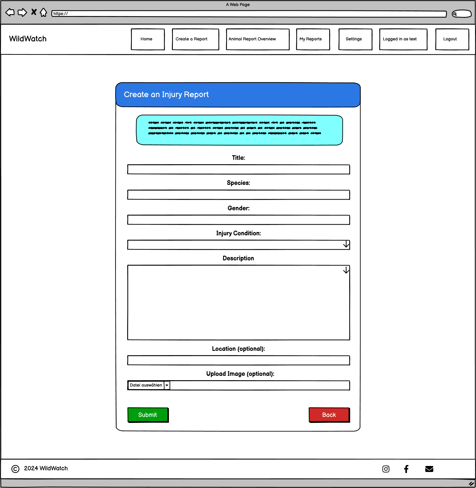
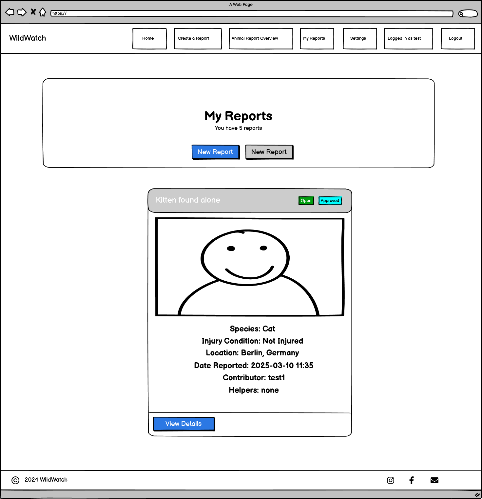

# Wild Watch

### Here you can explore the [Live webpage](https://wild-watch-4ac96b54e024.herokuapp.com/)

## Developer

| Name            | Linkedin                     | GitHub           |
| --------------- | ---------------------------- | ---------------- |
| Christian Borza | [Linkedin Profile](https://www.linkedin.com/in/borzachristian/) | [GitHub repositories](https://github.com/ChrisCross1983) |

## About

Wild Watch is a full-stack Django web application that empowers users to actively contribute to wildlife conservation by reporting animal sightings and injuries. The platform enables individuals to create, manage, and explore reports, while fostering community engagement around nature protection.

The goal of Wild Watch is to bridge the gap between observation and action - making it easier for everyday people to help protect animals and their habitats. Whether you're an animal lover, volunteer, or conservation enthusiast, this platform offers a meaningful way to make a difference.

## Project Goals

### User Goals

- Provide an intuitive way to report wildlife sightings.
- Allow users to manage their reports (create, update, delete).
- Offer a way to stay updated on submitted reports by other users.

### Business Owner Goals

- Establish a user-friendly platform for wildlife data collection.
- Build a community engaged in wildlife conservation.
- Ensure secure and seamless functionality for report management.

## User Stories

### 1. User Registration  
**As a new user**, I want an easy account setup to enjoy personalized features.  
**Acceptance:** Users enter email, username, and password. Errors show for taken usernames/emails.

### 2. Email Verification  
**As a user**, I want to verify my email to activate my account securely.  
**Acceptance:** System sends confirmation email. Unverified users get reminder and can resend link.

### 3. Login  
**As a user**, I want to log in securely with my credentials.  
**Acceptance:** Valid username and password allow access. Errors are shown for invalid attempts.

### 4. Logout  
**As a user**, I want to log out to end my session securely.  
**Acceptance:** Clicking logout redirects to homepage and ends session.

### 5. Password Reset  
**As a user**, I want to reset my password in case I forget it.  
**Acceptance:** Users request reset link via email and create new password.

### 6. View Profile  
**As a user**, I want to view my personal profile and account data.  
**Acceptance:** Profile page displays name, username, email, and profile picture.

### 7. Edit Profile  
**As a user**, I want to update my account information.  
**Acceptance:** Users can change name, email, picture. Confirmation messages shown after saving.

### 8. Change Email Address  
**As a user**, I want to change my email address and verify it again.  
**Acceptance:** After email change, user is logged out and must re-verify new address.

### 9. Upload Profile Picture  
**As a user**, I want to upload a personal profile image.  
**Acceptance:** Uploaded picture is displayed in the profile view. Fallback image used if none uploaded.

### 10. Delete Account  
**As a user**, I want the option to delete my account permanently.  
**Acceptance:** A confirmation prompt ensures users really want to delete. Account is removed from database.

### 11. Create Report  
**As a user**, I want to report injured or sighted animals.  
**Acceptance:** Users complete form with required fields. Upon success, report is stored.

### 12. Edit Report  
**As a user**, I want to correct or update information in my report.  
**Acceptance:** Users can edit their own reports. Changes are saved and displayed after approval.

### 13. Delete Report  
**As a user**, I want to remove reports I created.  
**Acceptance:** Users confirm deletion before report is removed.

### 14. View All Reports  
**As a user**, I want to browse existing wildlife reports.  
**Acceptance:** Reports are shown in a list view with filters and pagination.

### 15. Filter Reports  
**As a user**, I want to filter reports by species or keywords.  
**Acceptance:** Filtered results are shown immediately based on user input.

### 16. Help on Report  
**As a user**, I want to volunteer to help on a report.  
**Acceptance:** Button adds user as helper. System prevents duplicate actions during load time.

### 17. Cancel Help  
**As a user**, I want to withdraw my help from a report.  
**Acceptance:** Users confirm cancellation, system removes them from helper list.

### 18. View Report Details  
**As a user**, I want to see full details of each report.  
**Acceptance:** Clicking “View Details” shows expanded view with all report data and helper status.

## User Experience

### Target Audience

- Animal & Wildlife enthusiasts.
- Environmental activists and organizations.
- General users interested in contributing to wildlife protection efforts.

### User Requirements and Expectations

- Accessible and responsive design.
- Simple navigation and intuitive layout.
- Clear feedback during interactions (e.g., successful submission or errors).
- Secure user authentication.

### Agile Methodologies

The project followed Agile principles using:

- GitHub Projects: Kanban board to track tasks and progress.
- User Stories: Each feature aligned with specific user or business needs.

[Link to GitHub Project Board](https://github.com/users/ChrisCross1983/projects/5)

## Design

### Design Decisions

The overall design of Wild Watch was created with clarity, accessibility, and emotional connection in mind. The color palette reflects a nature-oriented theme to align with the purpose of wildlife protection.

### Colors

Primary colors include:

- **Yellow-Orange (#FFC857)**: The main branding color used for the navigation bar and general call-to-action elements, evoking warmth and attention.
- **Green (#1A7F3C)**: A secondary accent color representing nature, conservation, and helper status indicators.
- **Neutral tones (#F4F4F4, #333333)**: Provide balance and contrast for a readable, clean user interface.

### Color Scheme

The visual identity of Wild Watch is based on warm, natural tones that reflect wildlife and conservation.

| Hex Code  | Usage                | Description                                                      |
|-----------|----------------------|------------------------------------------------------------------|
| `#FFC857` | Primary / Navbar     | Main brand color for navigation and call-to-actions              |
| `#1A7F3C` | Success / Text Icons | Green tone used in helper labels and visual accents              |
| `#F4E4BC` | Section Background   | Soft beige background for content blocks                         |
| `#D67B4B` | CTA-Highlight        | Contrast color for emphasis in special sections                  |
| `#42C460` | Success Badge        | Used to indicate successful report interaction                   |
| `#F0B914` | Warning Badge        | Warning and pending status visuals                               |
| `#830814` | Danger Badge         | Error messages and rejected reports                              |
| `#49A9E9` | Info Badge           | Informational elements and icons                                 |
| `#333333` | Main Text Color      | Strong dark tone for body and headline text                      |
| `#F4F4F4` | Light BG Elements    | Light grey for containers and subtle background elements         |

> *Note:* Additional utility classes from Bootstrap (e.g., `.btn-success`, `.alert-danger`) were partially customized to reflect this color palette.

### Fonts

Typography was selected for readability and aesthetic harmony:

- **Headings:** Montserrat (modern, clean).
- **Body text:** Open Sans and Arial (easy to read across devices).

### Layout & Structure

The layout follows a structured, user-friendly approach:

- **Card-based design** for displaying reports in a clear and organized format.
- **Fixed navigation bar** to ensure consistent access to main features.
- **Sidebar filters** for intuitive content sorting.
- **Hero sections** with immersive background images to highlight the context of each page (e.g., rhino, elephant, leopard visuals).
- **Mobile-first responsiveness** ensures accessibility on all screen sizes.

Visual hierarchy was created through:

- **Consistent button styles** (primary, danger, success, etc.) to guide user actions.
- **Badges and alert styles** to highlight report status and feedback.
- **Rounded elements** (cards, buttons, images) for a soft and friendly visual appeal.

### Wireframes

Wireframes were created for desktop, tablet, and mobile views using Balsamiq to visualize the layout structure and user flow at an early project stage.  
>Please note: The final implemented UI may differ slightly from these drafts due to design iterations and responsive adjustments during development.

<strong>Samples of the initial design drafts</strong>

Navbar & Footer (Desktop & Mobile View):

Homepage:

Sign Up Page:

Login Page:

Animal Report Overview Page:

Create a Report Page:

My Reports Page:

My Profile Page:

 

### Responsive Design

WildWatch is fully responsive and optimized for various screen sizes, from large desktops to tablets and smartphones. The application was developed using a mobile-first approach and adapts layout and content dynamically based on device resolution.

Key responsive elements include:

- **Floating Action Button (FAB)** on mobile for better accessibility.
- **Card-based layout** that scales and stacks responsively.
- **Collapsible menus and sidebar filters** for smaller screens.
- **Auto-scaling images and text content** based on viewport width.

<strong>Sample Views:</strong>

  
  

 

## Database Diagram

The application uses a relational database with key models:

User: Stores user authentication details.
Profile: Extends user with additional fields (e.g., email verification token).
Report: Captures wildlife sighting details.

## Key Features

<strong>Navigation & Footer</strong>

The navigation bar and footer are part of the base_generic.html template and are consistently rendered across all pages of the WildWatch platform.

The navigation bar displays the WildWatch brand name and provides context-based links depending on the user's login status.

- For **non-authenticated users**, the navbar shows:

    - Home
    - Login
    - Signup

- For **authenticated users**, the navbar adapts based on user roles:
    - Regular users see:
        - Home
        - Create a Report
        - Animal Reports Overview
        - My Reports
        - Settings
        - Logout

    - **Staff users** see:
        - Home
        - All Reports Feed
        - Manage Reports
        - Logout

A status label is also shown, indicating the currently logged-in username.

Navigation Links:

- **WildWatch / Home** → Homepage (index.html)
- **Create a Report** → New wildlife report form
- **Animal Reports Overview** → All public reports submitted
- **My Reports** → Personal report management view
- **Settings** → Profile overview and actions
- **Login / Signup / Logout** → Authentication options

The footer is visible on every page and includes:

- Copyright notice: © 2024 WildWatch
- Social media icons:
    - **Instagram** → opens https://instagram.com
    - **Facebook** → opens https://facebook.com
    - **Email icon** opens default email client with a pre-filled recipient: mailto:contact@wildwatch.org

All icons are styled using Font Awesome and include appropriate accessibility features such as aria-label and rel="noopener noreferrer".

> The consistent placement of navigation and footer ensures a clear user flow and accessibility across all screen sizes.

 

<strong>Home Page</strong>

When users land on the platform, they are welcomed by the Home Page. The page is structured into multiple informative and visually engaging sections to introduce the platform and guide users toward action.

- **Hero Section**:  
  A large welcoming banner with a dark overlay introduces users to WildWatch with the message “Welcome to WildWatch – Protecting animals and their habitats.” A large button invites users to view animal reports, leading to the Animal Reports Overview.

- **About WildWatch**:  
  This section gives a short introduction to the purpose of the platform. It highlights the importance of community-driven efforts in animal protection and encourages users to take part in conservation activities.

- **How It Works Section**:  
  This section explains the core functionalities of the platform through three illustrated content boxes:
  
  1. **Submit a Report** – Users can report animal incidents (e.g., injured animals or illegal activity).
  2. **Track Updates** – Users can follow the progress and resolution of their reports.
  3. **Make a Difference** – Users are encouraged to help as volunteers or share awareness.

  Each feature box is accompanied by a unique wildlife-themed icon and animal image, enhancing visual engagement.

- **Call-to-Action Section**:  
  A motivational area encouraging users to join the WildWatch community. Logged-in users are invited to create a report. Non-logged-in users see two prominent buttons: **Sign Up** and **Log In**.

This page helps set the tone of the platform, combining emotional appeal with clear functionality to engage first-time visitors effectively.

 

<strong>User Registration & Email Verification</strong>

The Sign Up page allows new users to register and create a personal account to use all platform features.

- **Existing users** can click the “Login” link to access their account instead.
- **New users** are guided through a registration form that includes the following fields:
  - Username *(required)*
  - First Name *(optional)*
  - Last Name *(optional)*
  - Email *(optional)*
  - Profile Picture *(optional, preview displayed upon upload)*
  - Password *(required)*
  - Confirm Password *(required)*

All form fields are clearly labeled and include inline validation. If any input is incorrect (e.g., password too weak or mismatched), the user receives direct feedback below the corresponding field.

**Password Requirements:**
- Minimum of 8 characters
- Not too similar to other user data
- Not a commonly used password
- Not entirely numeric

The form includes visual feedback and auto-disable behavior on submission to prevent multiple form submissions. After successful submission, users are redirected to a confirmation page.

### Sign Up Confirmation Page
After submitting the form successfully, users see the **Registration Successful** page. It confirms that registration was completed and asks the user to verify their email address. A button on this page leads directly to the login page.

### Verification Email

After completing the **Sign-Up form**, users are redirected to a **Thank You page**, informing them that they must verify their email address to activate their account.

A confirmation email is automatically sent to the email address provided during registration.  
This email includes a secure link like the following:

### Email Verification Message 

When users click the verification link, they are redirected to the **Email Verification Page**, which confirms successful activation:

> "Your email has been verified. You can now log in."

A Bootstrap-styled success message is displayed in a card layout. The system automatically handles invalid or expired tokens by showing appropriate alert messages.

This flow ensures all users have valid email addresses before accessing account features — improving security and data quality.

 

<strong>Login Page</strong>

The Login page allows registered users to access their account securely.

- The form consists of two required fields:
  - **Username**
  - **Password**

If the user enters incorrect credentials, appropriate error messages will appear directly below the respective field or as a general form error message.

Additional features:
- A **Forgot your password?** link is available for users who need to reset their login credentials. This leads to the password reset page.
- A **Back to Home** link is provided for users who wish to navigate away without logging in.

After entering valid credentials and submitting the form, users are redirected to the Home page and receive a success message:  
*"Successfully signed in as (username)."*

 

<strong>Password Reset Flow</strong>

The platform provides a full password recovery process for users who have forgotten their credentials.

### Step 1: Request Password Reset  
On the **Reset Password** page, users can request a reset link by entering their registered email address. If the email exists in the system, a reset link will be sent.  
Form fields:
- **Email** (required)

After submitting a valid email address, the user is redirected to the **Password Reset Requested** page.  
This page informs the user that – if the email exists in the system – a reset link has been sent.

> _“If an account with that email exists, a password reset link has been sent. Please check your email inbox (and spam folder).”_

### Step 2: Password Reset Email  
The user receives an automated email containing a reset link.  
Example email content:

> Hi (username),  
> You requested a password reset. Click the link below to reset your password:  
> `https://wild-watch.../users/password-reset-confirm/...`  
> If you didn't request this, you can ignore this email.  
> – The WildWatch Team

### Step 3: Set New Password  
After clicking the email link, users are redirected to a **Set New Password** page, where they can enter and confirm a new password.

### Step 4: Password Reset Confirmation  
Once submitted, users are taken to a **Password Reset Complete** page, with a message confirming success and a link to log in again.

Throughout the process, users receive feedback messages for a clear and user-friendly experience. If the email is not recognized, no error is revealed for security reasons, but a standard confirmation is shown.

 

<strong>Profile Management</strong>

Once users are logged in, they can access their **Profile page** via the navigation bar. This section allows them to view and manage their personal account details.

### Profile Page  
The **profile.html** displays the user's current information including:

- Profile picture (or a default placeholder image if none is uploaded)
- First and last name
- Username
- Email address (not editable here, but visible)
- Obfuscated password (with a reminder link to reset it via "Forgot your password?")

The user can perform the following actions from this page:

- **Edit Profile** → Redirects to the edit form (`edit_profile.html`)
- **Delete My Account** → Submits a confirmation-triggered deletion form
- **Back** → Returns to the homepage

### Edit Profile Page  
On the **edit_profile.html**, users can update their personal data:

- First name
- Last name
- Username
- Email address
- Upload or change their profile picture (preview is shown before saving)

Each field is validated, and error messages are displayed inline if validation fails. Upon clicking **Save Changes**, the updated data is stored and the user is redirected back to the profile view.

### Delete Account  
From the **Profile page**, users can delete their account.  
Upon clicking **Delete My Account**, a confirmation alert appears. If confirmed, the account and all associated data will be removed permanently.

All forms are CSRF-protected and styled consistently with Bootstrap to ensure both security and accessibility.

 

<strong>Create Report Page</strong>

On the **Create Report** page, authenticated users can submit a new animal injury report by filling out a structured form. This page plays a key role in the mission of WildWatch by enabling users to actively contribute to wildlife protection.

### Purpose
The page begins with an informational alert message that highlights the importance of reporting injured animals to enable timely rescue and care.

### Report Form Inputs:
- **Title (required):** A brief headline for the report.
- **Species (required):** Dropdown list of available animal species.
- **Gender (required):** Selection between Male / Female / Unknown.
- **Injury Condition (required):** Selection field describing the animal's condition (e.g., Minor injury, Severe injury, Unknown).
- **Description (required):** Free text input field for detailed information.
- **Location (optional):** Field to enter the location of the incident.
- **Image Upload (optional):** Users can attach a photo to support their report.

The form includes validation for required fields and displays error messages below each field if inputs are invalid.

### Submit Action:
Users click **Submit** to send their report. A loading spinner provides visual feedback while the form is being processed. Once submitted, the report is stored in the database and forwarded for review.

A **Back** button below the form allows users to return to the Animal Reports Overview page.

 

<strong>Animal Reports Overview, Detail & Edit</strong>

### Animal Reports Overview Page

The **Animal Reports Overview** page displays all submitted wildlife reports in a user-friendly card-based layout.

Each report card contains:

- **Report Title**
- **Status Badges**: Approval status (e.g., Pending, Approved, Rejected) and Publication status.
- **Report Image** (if provided)
- **Species, Injury Condition, Location, Date Reported**
- **Contributor Name** and **List of Helpers**

Below each card, users find action buttons:

- **View Details**: Redirects to the Report Detail Page.
- **Help / Cancel Help**: Logged-in users can support a report or withdraw help.
- Conditional buttons are shown depending on the user's role (reporter/helper).

### Additional Features:

- **Left Sidebar Navigation**: Quick access to “Create Report” and “My Reports”.
- **Right Sidebar Filter Panel**:
  - Search by keyword
  - Filter by species (Cat, Dog, Other)
  - Apply or reset filters
- **Pagination Navigation** at the bottom of the page.
- **Mobile FAB (Floating Action Button)** opens a responsive modal menu for smaller screens.

---

### Report Detail Page

Clicking on **View Details** opens the detailed view of the report, showcasing:

- All report data fields
- Full image preview
- Helper status indication
- Edit/Delete options (only for the report owner)
- Help/Cancel Help buttons (if not the owner)

The page also includes contextual alerts (e.g., “You are currently helping with this report”).

---

### Edit Report Page

If the logged-in user is the original author of a report, they can update it via the **Edit Report Page**.

The form is pre-filled with existing data, and allows the user to:

- Change title, species, gender, injury condition, description, location
- Upload a new image
- Submit changes

Upon successful edit, users are redirected with a success message, and the updated report is stored in the database.

If a previously rejected report is resubmitted, it will return to **Pending status** and await new admin review.

---

### Delete Report

Users who submitted a report also have the option to **permanently delete it** from the system.

Upon clicking **Delete**, a confirmation alert will appear asking the user to confirm the action before the report is removed.

*You may include a screenshot of the delete alert confirmation here for illustration.*

 

  
<strong>My Reports</strong>

### My Reports Page

The **My Reports** section allows users to review all the injury reports they have personally submitted.

After logging in, users access this page via the main navigation or from buttons on other report pages.

#### Features:

- A **hero section** summarizes the total number of submitted reports and offers quick buttons:
  - **New Report**: Redirects to the report creation form.
  - **Animal Report Feed**: Returns to the full public overview of all reports.

- Each submitted report is shown as a **detailed card**, including:
  - **Title**, **Species**, **Injury Condition**, **Location**, **Date**, **Helper List**
  - **Status badges** (Pending, Approved, Rejected)
  - **Uploaded image preview**, if available

#### Additional Behaviors:

- If a report was **rejected**, the **admin rejection comment** is shown prominently in a red alert box.

- Users can navigate to the **Report Detail Page** via the “View Details” button on each card.

- From the detail page, **edit and delete actions** are available to the report owner.

- Mobile users benefit from a **Floating Action Button (FAB)** that opens a modal menu for fast access to essential actions.

Admin rejection comment:

Floating Action Bubble:

Floating Action Bubble (extended):

 

<strong>Admin Panel & Report Moderation</strong>

### Admin Access & Moderation Features

The platform includes a built-in **moderation and admin system** to ensure quality control and prevent abuse.

Only users with staff privileges have access to the **admin interface** and additional moderation tools.

#### Admin Navigation

Once logged in, staff members see two additional navigation links:

- **All Reports Feed** – shows all submitted reports by all users.
- **Manage Reports (Pending Reports)** – filtered view of only unapproved reports that require moderation.

#### Manage Reports Page

- The **Pending Reports Page** allows admins to:
  - Review each report in detail.
  - Decide whether to **approve** or **reject** submissions.
  - Leave an **admin comment** in case of rejection (e.g., missing image, unclear description).

- Each report card includes:
  - Title, Species, Injury Condition, Location, Date, Reporter
  - Buttons for **Approve** or **Reject**
  - Text field for **admin rejection comments**

- After action is taken:
  - Status updates are reflected across the user’s **My Reports** view.
  - Rejected reports show the admin comment as a red alert on the user's dashboard.
  - Users can revise and **resubmit rejected reports**.

#### Admin Panel (Django Admin Interface)

The Django admin backend allows full access to:

- **User management** (CRUD)
- **Reports overview** (create/edit/delete reports manually)
- **Profile information**
- **Helpers list**

Accessible at `/admin/` route for authorized staff only.

## Future Improvements

- Real-time notifications for new reports and helper updates.
- Social media sharing of reports (Facebook, Instagram, WhatsApp).
- Contributor badges and community ranking system.
- Admin dashboard analytics and moderation tools.
- Mobile app version for quicker reporting on the go.
- Gamification elements to motivate conservation efforts.
- Report location mapping (Google Maps or Leaflet.js integration).

## Technologies Used

### Languages

- Python 3
- HTML5
- CSS3
- JavaScript (ES6+)

### Libraries & Frameworks

- Django (Backend Framework)
- Bootstrap (Styling and UI Components)
- jQuery (Used selectively for interactivity)

### Django Packages

- `django-allauth` – Authentication and email verification
- `dj-rest-auth` – RESTful login/registration endpoints
- `django-crispy-forms` – Enhanced form rendering
- `whitenoise` – Serving static files
- `cloudinary` – Image storage and media optimization
- `Pillow` – Image processing
- `python-decouple` – Environment variable management
- `django-message-framework` – Flash messaging for user feedback

### Deployment & DevOps

- Heroku (Production Hosting)
- Gunicorn (WSGI HTTP server)
- GitHub (Version control and project board)

## Testing

### Accessibility

- The platform adheres to **WCAG 2.1 AA guidelines**
- ARIA labels and roles are implemented for screen reader compatibility
- Contrast levels tested with WebAIM contrast checker

### Performance Optimization

- Optimized static file handling via Django Whitenoise
- Lazy loading of images and media
- Minified CSS and compressed assets
- Lighthouse audits conducted across all key user flows

### Device & Browser Compatibility

- **Devices tested:**
  - Desktop: Windows, macOS
  - Mobile: Android, iOS

- **Browsers tested:**

  - Google Chrome (desktop/mobile)
  - Mozilla Firefox
  - Microsoft Edge

### Automated Testing

- **HTML Validation**: Used the [W3C HTML Validator](https://validator.w3.org/) which returned the following results:

    **Before**:

    

    **After**:

    

- **CSS Validation**: Used the [W3C CSS Validator](https://jigsaw.w3.org/css-validator/) which returned the following results:

    

- **JavaScript Validation**: Used [JSHint](https://jshint.com/) to validate JavaScript code. The validation process returned a clean report compliant with ES6+ standards.

### Lighthouse scores

Lighthouse metrics were scored on Incognito Chrome

### Running Tests

Although automated tests (e.g., unit tests or integration tests) are considered best practice in professional development workflows, they were not implemented in this project. The project scope focused primarily on core functionality, UI/UX design, and manual end-to-end testing in line with the PP4 requirements.

### Manual Testing Overview

All major user flows were tested manually to ensure functional coverage, usability, and correct feedback behavior across devices and user roles. The tables below outline test scenarios, expected outcomes, and actual results.

---

<strong>General User Functional Tests</strong>

| Test Name                      | Steps                                                             | Expected Result                                                   | Actual Result       | Pass/Fail |
|-------------------------------|-------------------------------------------------------------------|-------------------------------------------------------------------|----------------------|-----------|
| Home Navigation               | Click "WildWatch" logo or Home link in navbar                     | User is redirected to homepage                                   | Same as expected     | ✓         |
| Signup Process                | Click Signup → Fill form → Submit                                 | Account created & verification email sent                        | Same as expected     | ✓         |
| Signup with invalid data      | Leave required fields empty → Submit                              | Inline error messages shown                                      | Same as expected     | ✓         |
| Signup with existing username | Fill form with already registered username → Submit               | Error message: "A user with that username already exists."        | Same as expected     | ✓         |
| Email Confirmation Flow       | Register → Click email verification link                          | Account gets activated                                           | Same as expected     | ✓         |
| Resend Verification Email     | Try login unverified → Click “Resend Email”                       | New confirmation email is sent                                  | Same as expected     | ✓         |
| Login (valid credentials)     | Enter correct credentials → Submit                                | User logs in successfully                                       | Same as expected     | ✓         |
| Login (wrong credentials)     | Enter wrong password → Submit                                     | Error message: "Invalid password."                               | Same as expected     | ✓         |
| Login (unverified user)       | Attempt login before email verification                           | Error: “Account not verified” message shown                      | Same as expected     | ✓         |
| Password Reset Flow           | Click “Forgot password” → Enter email → Receive link → Set new pw | Password reset completed successfully                            | Same as expected     | ✓         |
| View Profile                  | Navigate to Settings/Profile                                      | Profile details are displayed                                   | Same as expected     | ✓         |
| Edit Profile                  | Edit profile data → Submit                                        | Data updated, success message shown                             | Same as expected     | ✓         |
| Edit Email Address            | Change email → Submit                                             | User logged out → Verification email sent                        | Same as expected     | ✓         |
| Upload Profile Picture        | Upload image → Submit                                             | Image preview visible, saved to profile                         | Same as expected     | ✓         |
| Delete Account (cancel)       | Click Delete → Cancel confirmation popup                          | No action taken                                                  | Same as expected     | ✓         |
| Delete Account (confirmed)    | Click Delete → Confirm popup                                      | Account and data deleted                                        | Same as expected     | ✓         |
| Submit a Report               | Fill report form → Submit                                         | Report created and saved                                         | Same as expected     | ✓         |
| Edit Report                   | Open own report → Edit fields → Submit                            | Report updated, confirmation shown                              | Same as expected     | ✓         |
| Delete Report                 | Click Delete on own report → Confirm                              | Report deleted from system                                      | Same as expected     | ✓         |
| View All Reports Feed         | Click “Animal Reports Overview”                                   | Public reports displayed in list                                | Same as expected     | ✓         |
| Filter Reports (species/keyword) | Select species or enter keyword → Apply filter                  | Filtered reports displayed                                      | Same as expected     | ✓         |
| View Report Details           | Click “View Details” on report card                               | Full report detail shown                                        | Same as expected     | ✓         |
| Help on Report                | Click “I want to help” on report                                  | User added to helpers, button changes                           | Same as expected     | ✓         |
| Cancel Help                   | Click “I can no longer help”                                      | User removed from helpers                                       | Same as expected     | ✓         |
| Scroll-to-Top Button          | Scroll down → Click scroll arrow                                 | Page scrolls to top smoothly                                    | Same as expected     | ✓         |
| Responsive Mobile View        | Open site on mobile → FAB menu visible                           | Responsive behavior confirmed                                   | Same as expected     | ✓         |
| Navigation Menu               | Click through navbar items                                        | Pages load correctly                                             | Same as expected     | ✓         |
| Session Persistence           | Login → Navigate through site                                     | Session remains active                                           | Same as expected     | ✓         |
| Logout                        | Click Logout button                                               | User is logged out and redirected                               | Same as expected     | ✓         |

 

---

<strong>Edge Cases & Negative Testing</strong>

| Test Name                            | Steps                                                               | Expected Result                                               | Actual Result       | Pass/Fail |
|-------------------------------------|---------------------------------------------------------------------|---------------------------------------------------------------|----------------------|-----------|
| Upload invalid profile picture      | Try uploading non-image file (e.g. .pdf) as profile image → Submit | Error: "Upload a valid image."                                | Same as expected     | ✓         |
| Submit Report – Missing Fields      | Leave required report fields empty → Submit                        | Inline validation errors shown                                | Same as expected     | ✓         |
| Submit Report with large image      | Upload very high-res image → Submit                                 | Image saved successfully, scaled in display                   | Same as expected     | ✓         |
| Edit Report Image                   | Edit existing report → Upload new image → Submit                   | New image replaces previous one                               | Same as expected     | ✓         |
| Attempt edit by another user        | Login as another user → Access another user's edit URL             | Redirect or access denied                                     | Same as expected     | ✓         |
| Attempt delete by another user      | Login as another user → Access delete URL of other's report        | Redirect or access denied                                     | Same as expected     | ✓         |
| Filter Reports – no match           | Enter a rare/invalid keyword → Submit                              | Message shown: "No reports found matching your criteria"      | Same as expected     | ✓         |
| Try to help on own report           | Open own report detail page                                        | "Help" button is not visible                                  | Same as expected     | ✓         |
| Attempt double-helping              | Click “I want to help” multiple times rapidly                      | Only one helper entry added, button becomes disabled          | Same as expected     | ✓         |
| Admin – Reject Report with Comment  | Admin logs in → Rejects report → Adds rejection comment            | Status set to "Rejected", comment visible for user            | Same as expected     | ✓         |
| Admin – Approve Report              | Admin logs in → Approves report                                    | Status set to "Approved"                                      | Same as expected     | ✓         |

 

## Bugs

### Known Issues

- Minor responsiveness issues on some legacy mobile devices.
- Occasionally delayed loading of images from Cloudinary on slow connections.
- Scroll-to-top button may overlay content on small screens.
- Report filtering may not reset fully on some browsers without full page reload.
- Flash messages occasionally overlap with form errors (visual stacking issue).
- Form auto-disabling may prevent resubmission after validation failure in some edge cases.

### Resolved Issues

- Fixed email verification token errors on expired links.
- Improved help/cancel button feedback to prevent duplicate clicks during load.
- Addressed issues with profile picture preview not displaying correctly in some browsers.
- Solved database migration errors related to `reports_injuryreport_helpers` table.
- Fixed incorrect message flow after account deletion.

> All reported issues were tracked and resolved via GitHub commit references.

## Deployment

### Clone & Local Setup

To run the project locally:

1. Open your terminal (e.g., Git Bash, Command Prompt, Terminal).
2. Clone the repository:

    - git clone https://github.com/ChrisCross1983/pp4-wildwatch.git
    - cd pp4-wildwatch

3. Create and activate a virtual environment:

On macOS/Linux:

    - python -m venv .venv
    - source .venv/bin/activate

On Windows:

    - python -m venv .venv
    - .venv\Scripts\activate

4. Install all required packages:

    - pip install -r requirements.txt

5. Create a .env file in the project root and add the following variables:

> Example of how environment variables are loaded in `settings.py`:

6. Run the server locally:

    - python manage.py makemigrations
    - python manage.py migrate
    - python manage.py runserver

### Deployment via Heroku

1. Navigate to [heroku](https://www.heroku.com/home) and create an account.
2. Click `Create new app`, enter the app name and choose your region, hit `create app`.
3. Click **Deploy** and in the _Deployment method_ option choose **Github**. Enter the repository's name and click connect, you can leave the branch deployment to `main`.
   > You need to have created your github repository.
4. Head to **Settings** and click `Reveal config vars`
5. On the KEY inputs add: DATABASE_URL - SECRET_KEY - CLOUDINARY_URL - DEBUG. On the VALUE inputs add your own, for each one.
6. Click **Add buildpack** and choose `python`.
7. Now you're set. Go back to `Deploy` and click **Deploy branch**.

Heroku will install packages, apply migrations and launch the app.

### Forking the Project

Forking a repository is commonly done to contribute to another developer's project or to use it as the foundation for your own. To fork a repository:

1. Click the **Fork** button at the top right of the repository page.
2. This creates a separate copy in your own account for further modification or contribution.

## Credits

- [WebAIM](https://webaim.org/) – Contrast Checker (Accessibility Testing)
- [TinyPNG](https://tinypng.com/) – Image Compression
- [Icons8](https://icons8.com/) – Favicon and UI icon sets
- [Font Awesome](https://fontawesome.com/) – Icon integration
- [Unsplash](https://unsplash.com/) – Free wildlife placeholder images
- [Balsamiq](https://balsamiq.com/) – Wireframe design

### Additional Resources & Support

Throughout the development process, various tools and platforms were consulted to support error resolution, refresh knowledge, and ensure efficient troubleshooting:

- [chatgpt](https://chatgpt.com) - Used as a support tool for resolving technical issues and validating code logic.
- [StackOverflow](https://stackoverflow.com) - Community-driven platform for researching specific error messages and best practices.
- [YouTube](https://youtube.com) - Reference for tutorial content and visual explanations to reinforce concepts and workflows.

### Media

- Wildlife visuals (lion, elephant, giraffe, rhino, leopard) created with help of chatgpt.com.
- All user-uploaded media is handled securely and optimized via Cloudinary.

## Acknowledgements

I would like to thank those who were a great support and inspiration during writing this project:

- My wife, who supported me during the process of creating this project.
